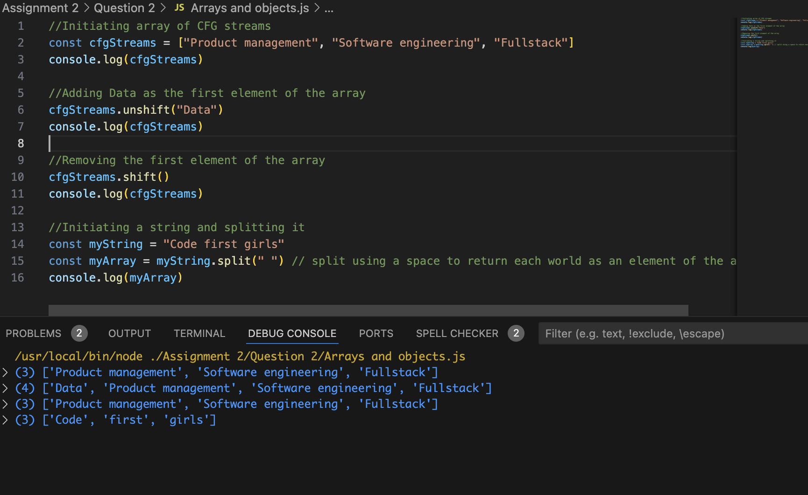
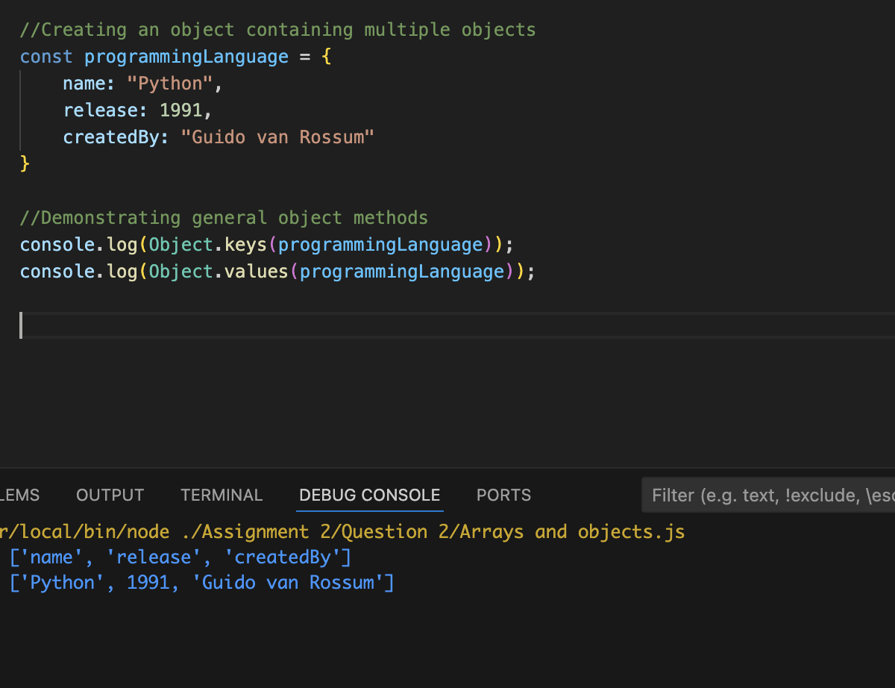

# Question 2

## 2.1: Arrays

- Unshift() is a method used to add an element to the beginning of the array. The new elements name would be input as a parameter into the brackets

- Shift () removes the first element of an array

- Split () is a method used to split a string into substring return these as elements of a new array. The separator can be input as a parameter, it tells the method where to split the string and the separator itself is not included in the returned array. If no seperator is input, the full string is returned as one array element. An optional limit can also be added that limits the number of splits so nothing after the split is returned

These methods have been demonstrated in Arraypractice.png

## 2.2: Objects

- An object method could refer to multiple techniques that can be used on an obect. It may refer to a specific function that is defined inside an object. To call this we reference the object name first and then .methodName for example. This would be used if you wanted the object to perform a specific action or behaviour.

There are also built in Object Methods that exist in JavaScript, these can be used on any object data type to perform tasks such as retreiving data from or modifying data inside the object. Examples of general object methods are Object.keys(object) this returns a list of the key names in the object or Object.values(object) which does the same but with the value counterparts of the object key-value pair.

## 2.3: Events

JS events allow you to trigger an action in response to an event, usually something the user does on the page

- The 'onmouseover' event can be used to trigger a named function when the users hovers their mouse over a HTML element
- 'onclick' is an event that triggers a named function when the user clickes on a designated html element, usually a button
- The 'onkeydown' event triggers a function when the user presses any key on their keyboard
