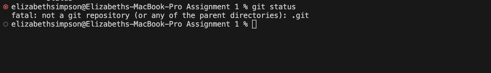
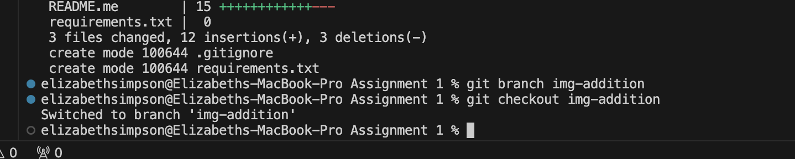
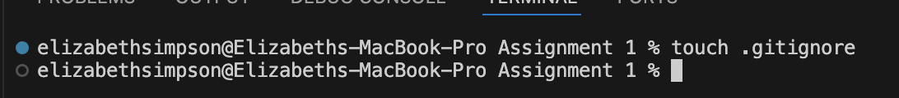
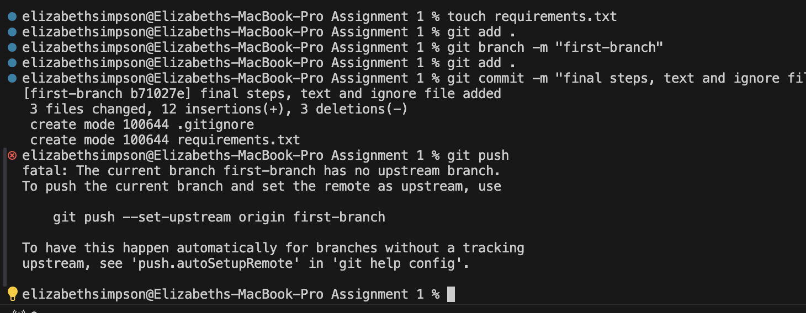
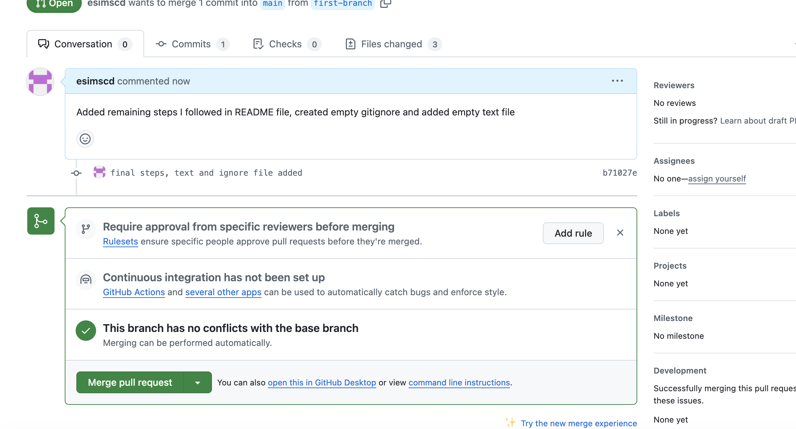

# CFG Assignment 1 - Git and GitHub

This repository will be used for the first assignent to demonstrate the use of Git commands and GitHub

## These are the stages I followed:

1. Created an empty repository on GitHub
2. Created a README file in VS code
3. Used `git status` to check status of file - it is currently not being tracked

   

4. Initiated git on this file using `git init`, added and commited the repository using `git add .` and `git commit -m`
5. Pushed the initial commit to remote repository CFG-Assignments using `git push`
6. Checked status of main on local - up to date
7. Created Branch and switched to it

   

8. Made changes to the branch, added steps, images, and added new files such as .gitignore and a requirements.txt file

   

   - A **.gitignore** is a file in the repository that tells git to ignore certain listed file types when committing to the repository.
     These files then stay in your local repository and are never pushed to the remote repository.

   - A **requirements.txt** is a text file used in Python to provide a list of progammes and software and their exact versions that the project depends on to run so other people collaborating on the project can install these and won't run into compatibility issues

9. Added, commited and pushed my finished branch

   

10. Created a pull request

    

11. Merged branch into main
    - Ended up repeating last steps branching and merging a few times when adding new features and making edits so some screenshots show different branches being used
